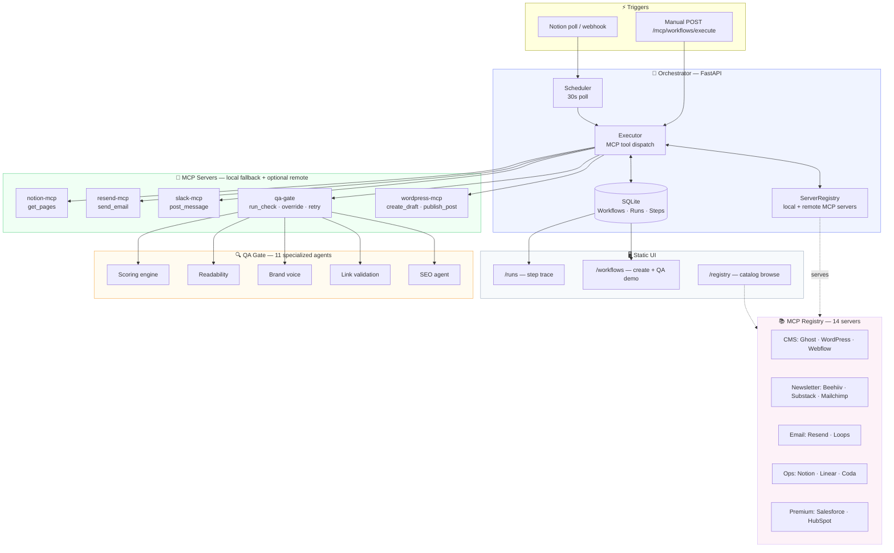
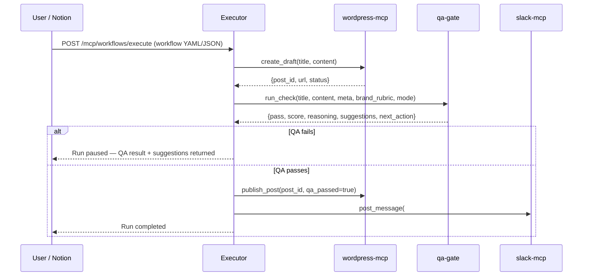

# ContentOps MCP Orchestrator

> **MCP-native content workflow engine** — draft to publish with AI quality gates, human approval, and full run tracing.

```
Notion draft → WordPress draft → QA gate → publish → Slack update → email notification
```

[](https://www.python.org/)
[](https://fastapi.tiangolo.com/)
[](https://modelcontextprotocol.io/)
[](https://modelcontextprotocol.io/)
[](#)

<p align="center">
  
</p>

<p align="center">
  
</p>

<p align="center">
  
</p>

---
## 🎥 Interactive Demo Flow

> ✨ Watch the workflow move from draft → QA gate → publish → Slack/email notifications in real time.

---

## 🚀 What this is

ContentOps MCP Orchestrator is a **beginner-friendly, MCP-native workflow project** that shows how content teams can automate publishing — without losing quality control.

Instead of just connecting apps, it answers a harder question:

> **How do you automate content publishing without shipping bad content?**

The answer: a **QA gate** that checks SEO, links, readability, and brand voice before any publish step runs. If the draft fails, the workflow pauses and tells you why. If it passes, it continues automatically.

This project is also a **hands-on 7-day tutorial** for learning FastAPI, workflow orchestration, and MCP-style tool modeling — built and debugged with AI assistance.

---

## ✨ What this project does

This project helps content teams and developers automate publishing safely.

In simple terms:

- A draft is created or fetched from a content source such as Notion.
- The orchestrator sends the draft through a workflow.
- The QA gate checks whether the draft is ready to publish.
- The workflow either pauses for a human editor or continues to publish.
- The run is visible in the UI, so you can see what happened at each step.

---

## Phase 1 to Phase 3

### Phase 1: MCP-inspired orchestrator

The project starts with a simple content workflow:

```
Notion → WordPress draft → Slack notification → Resend email
```

This teaches:
- FastAPI basics
- simple orchestration
- static UI structure
- workflow thinking

### Phase 2: MCP-native tool mesh

The project then moves toward real MCP-style design:

- integrations become MCP-style servers
- workflows become declarative
- tool calls are traceable
- the orchestrator behaves like an MCP client

### Phase 3: Registry and QA gate

The project adds two important layers:

1. **MCP server registry** — a curated registry for content-stack MCP servers.
2. **AI draft-to-publish QA gate** — a quality check before publishing.

This turns the project from a simple workflow runner into a quality-aware content operations platform.

---

## 🏗️ Architecture



### Request lifecycle (QA happy path)



---

## 🌟 Features

| Feature | Status | Description |
|---------|--------|-------------|
| Notion trigger | ✅ | Polls DB every 30s; converts pages to trigger events |
| MCP executor | ✅ | Dispatches tool calls across local + remote MCP servers |
| wordpress-mcp | ✅ | `create_draft`, `get_page`, `get_links`, `publish_post` |
| slack-mcp | ✅ | `post_message` via Incoming Webhook |
| resend-mcp | ✅ | `send_email` via Resend API |
| notion-mcp | ✅ | `get_pages`, `get_page` |
| **AI QA gate** | ✅ | 11-agent scoring: SEO · links · brand voice · readability |
| QA modes | ✅ | `manual_approval` · `auto_publish` · `send_to_editor` |
| QA actions | ✅ | `override_and_publish` · `retry_after_edit` · `send_to_editor_channel` |
| **MCP server registry** | ✅ | 14 servers across CMS · newsletter · email · ops · premium |
| Registry UI | ✅ | Browse, filter by category, search by tool name at `/registry` |
| Workflow DSL | ✅ | YAML/JSON workflow definitions with `input_map` templating |
| Run trace | ✅ | Full per-step `server::tool` trace at `/mcp/resources/runs/{id}/trace` |
| Static UI | ✅ | QA demo, pass/fail test, run history, registry browser |
| Test suite | ✅ | `tests/test_qa_gate.py`, `tests/test_registry.py`, spec JSON cases |

---

## ⚡ Quick start

### Prerequisites

- Python 3.10+
- Free accounts for: Notion, Slack Incoming Webhook, Resend (all optional for local mock testing)

### Install

```bash
git clone https://github.com/your-username/contentops-mcp.git
cd contentops-mcp

python -m venv venv
source venv/bin/activate        # Windows: venv\Scripts\activate

pip install -r requirements.txt
pip install -e .[wordpress,resend,notion,slack,qa]
```

### Configure `.env`

```env
NOTION_API_KEY=secret_...
NOTION_DATABASE_ID=your-database-id
SLACK_WEBHOOK_URL=https://hooks.slack.com/services/...
BLOG_BASE_URL=http://contentops.local
EMAIL_SERVICE_API_KEY=re_...
EMAIL_FROM=you@yourdomain.com
EMAIL_TO=team@yourdomain.com
```

> No API keys? All steps fall back to local mock responses. You can run the full QA demo without any external accounts.

### Run

```bash
uvicorn backend.main:app --reload
```

Open `http://localhost:8000`

---

### Fastest test

1. Open `http://localhost:8000/workflows`
2. Click **Run Failure Demo** → QA gate fails, workflow pauses, reasoning shown
3. Click **Run QA Workflow** → QA passes, publish step runs, run completes

---

## 🛡️ QA gate

The QA gate is a **zero-cost, local scoring engine** with 11 specialized agents. No external LLM required.

### What it checks

- SEO title completeness
- meta description completeness
- broken internal links
- brand voice consistency
- readability for the target audience

| Agent | Checks |
|-------|--------|
| SEO | Title length, keyword presence, meta description completeness |
| Link validation | Broken links, suspicious file types, poor anchor text |
| Brand voice | Matches against your `brand_rubric` string |
| Readability | Sentence length, passive voice, jargon density |
| Scoring engine | Weighted aggregate score; pass threshold configurable |

### Example output

```json
{
  "pass": false,
  "reasoning": "The draft is missing a meta description and contains a broken internal link.",
  "suggestions": [
    "Add a 140-160 character meta description.",
    "Fix the broken internal link.",
    "Add more concrete examples for the target audience."
  ]
}
```
### Modes

| Mode | Behavior |
|------|----------|
| `manual_approval` | Workflow pauses on fail; human reviews QA result |
| `auto_publish` | Workflow continues if score ≥ threshold |
| `send_to_editor` | QA result forwarded to `editor_channel` on fail |

### QA actions available as MCP tools

```
qa-gate::run_check              — run the full QA check
qa-gate::override_and_publish   — bypass QA and continue to publish
qa-gate::retry_after_edit       — re-run QA after editor updates draft
qa-gate::send_to_editor_channel — route failed draft to review channel
```

---

## 📚 MCP server registry

The registry is a curated catalog of content-stack MCP servers. Browse at `/registry` or query via API.

**Publishing:**
- WordPress
- Ghost
- Beehiiv
- Substack
- Webflow

**Email:**
- Resend
- Loops
- Mailchimp

**Planning:**
- Notion
- Linear
- Coda

Install any server as a package extra:

```bash
pip install contentops-mcp[ghost]
pip install contentops-mcp[beehiiv]
pip install contentops-mcp[wordpress,resend,notion,slack,qa]
```


### Registry API

```bash
# List all servers
curl http://localhost:8000/registry/servers

# Filter by category
curl "http://localhost:8000/registry/servers?category=cms"

# Search by tool name
curl "http://localhost:8000/registry/servers/search/semantic?q=publish_post"
```

---

## MCP server architecture

Four real MCP servers ship in `mcp_servers/`. Each is a standalone FastAPI app exposing `/tools` and `/use_tool`:

```
mcp_servers/
  notion_mcp/server.py      → port 8001
  wordpress_mcp/server.py   → port 8002
  resend_mcp/server.py      → port 8003
  slack_mcp/server.py       → port 8004
```

The orchestrator's `ServerRegistry` calls them if running, or uses **local fallback responses** if not. You don't need all four running for the demo — local fallback handles it automatically.

To run a specific server:

```bash
python -m mcp_servers.notion_mcp.server      # port 8001
python -m mcp_servers.wordpress_mcp.server   # port 8002
```

---

### Trigger the QA happy path

```bash
curl -X POST http://localhost:8000/mcp/workflows/execute \
  -H "Content-Type: application/json" \
  -d '{
    "workflow": "draft-to-publish-with-qa-gate",
    "trigger": {
      "server": "notion-mcp",
      "tool": "get_pages",
      "params": { "database_id": "$NOTION_EDITORIAL_DB" }
    },
    "steps": [
      {
        "server": "wordpress-mcp",
        "tool": "create_draft",
        "input_map": { "title": "{trigger.pages[0].title}", "content": "{trigger.pages[0].body}" }
      },
      {
        "server": "qa-gate",
        "tool": "run_check",
        "input_map": {
          "title": "{trigger.pages[0].title}",
          "content": "{trigger.pages[0].body}",
          "mode": "manual_approval"
        }
      },
      {
        "server": "wordpress-mcp",
        "tool": "publish_post",
        "input_map": { "post_id": "{steps[0].post_id}", "qa_passed": "{steps[1].passed}" }
      }
    ]
  }'
```

---

## 7-Day tutorial

This repo is a **7-day hands-on tutorial** for building a real MCP-native workflow engine from scratch with AI assistance.

---

### 🧭 Day 1 — Plan before you code

**Goal:** Understand the full system before touching code.

**Read:** `plan.md` · `prompts_cli.md` · `ROADMAP.md`

**Do:**
1. Fork and clone the repo
2. Create `.env` — mock values work for all keys
3. Read `plan.md` data model section carefully
4. Sketch: what data flows from Notion to email? what does each step need?


---

### 🏗️ Day 2 — Models and API skeleton

**Goal:** Database ORM models and REST routes wired up. No logic yet.

**Files:** `backend/models/*.py` · `backend/database.py` · `backend/web/api.py` · `backend/web/schemas.py`

**Test:**
```bash
uvicorn backend.main:app --reload
curl http://localhost:8000/api/workflows    # returns []
curl http://localhost:8000/health           # returns ok
```


---

### ⏰ Day 3 — Notion trigger and scheduler

**Goal:** System watches Notion and fires trigger events automatically.

**Files:** `backend/triggers/notion.py` · `backend/engine/scheduler.py`

**Key concept:** Scheduler runs as `threading.Thread(daemon=True)`, polls every 30s, calls `run_workflow()` for matching workflows.

**Test:** Add a Notion page. Wait 30s. Check logs for `[RUNNER] Starting workflow execution`.


---

### 🔌 Day 4 — Steps: blog, Slack, email

**Goal:** Three working async step functions with clear input/output contracts.

**Files:** `backend/steps/blog.py` · `backend/steps/slack.py` · `backend/steps/email.py`

**Key concept:** Each step is `async def action(**kwargs) -> dict`. The runner merges `step.parameters` + trigger config + previous step outputs and passes them as `**func_params`. Your function signature must match.

**Test:** Call each step directly in a Python REPL before wiring into the runner.


---

### ⚙️ Day 5 — Workflow engine and run tracing

**Goal:** Runner executes steps in order, writes every state change to DB, halts on first failure.

**Files:** `backend/engine/runner.py`

**Key concept:** `importlib.import_module(f"backend.steps.{step.app}")` loads the step module dynamically. `getattr(module, step.action)` gets the function. This is how adding a new step requires zero changes to the runner.

**Trace pattern:**
```
Run (running) → RunStep 1 (pending→running→completed) → RunStep 2 (...) → Run (completed/failed)
```

**Test:** `POST /api/trigger` → check `/api/runs` for full step trace.


---

### 🛡️ Day 6 — MCP executor and QA gate

**Goal:** Upgrade from legacy step runner to real MCP tool dispatch. Add the QA gate.

**Files:** `backend/mcp/protocol.py` · `backend/mcp/server_registry.py` · `backend/orchestrator/executor.py` · `backend/orchestrator/qa_gate.py`

**Key concept:** The executor calls `ServerRegistry.call_tool(server, tool, input)`. The registry tries the remote MCP server first (e.g. `http://127.0.0.1:8002/use_tool`), falls back to local mock if unavailable. The QA gate runs as `qa-gate::run_check` — no external API needed.

**Test:** `POST /mcp/workflows/execute` with a workflow JSON. Check `GET /mcp/resources/runs/{id}/trace`.


---

### 🎬 Day 7 — Registry UI and full demo

**Goal:** Registry browser works. Full QA pass/fail demo works. Everything documented.

**Test sequence:**
1. Open `/registry` — confirm all 14 servers listed, category filter works, tool search works
2. Open `/workflows` → **Run Failure Demo** → QA fails, workflow pauses
3. Open `/workflows` → **Run QA Workflow** → QA passes, publish runs
4. Open `/runs` → inspect full step trace for both runs
5. Check trace includes: `wordpress-mcp::create_draft` · `qa-gate::run_check` · `wordpress-mcp::publish_post` · `slack-mcp::post_message` · `resend-mcp::send_email`

**Record a demo GIF** — browser + terminal side by side, 10–15 seconds.

---

## How this differs from n8n, Zapier, and Make

| Area | n8n / Zapier / Make | ContentOps MCP |
|------|---------------------|----------------|
| Focus | General automation | Content-ops orchestration |
| Integration style | REST adapters | Real MCP servers with tool schemas |
| AI role | Optional LLM node | Built-in QA gate before every publish |
| Workflow format | Visual / proprietary | YAML/JSON DSL, version-controllable |
| Quality control | None built-in | 11-agent scoring engine |
| Run tracing | Basic logs | Full `server::tool` trace with I/O |
| Self-host cost | $0–$20/mo | Always free (SQLite, no infra) |
| Learning path | No tutorial | 7-day structured tutorial |

> n8n moves data between apps. ContentOps checks whether content is ready before it moves.

---

## Contributing

PRs welcome for:
- New MCP server adapters (add to `mcp_servers/` + `registry/servers.json`)
- New QA agents (extend `qa/agents/specialized.py`)
- Tutorial day feedback — open an issue if a step is unclear

---

## 🗺️ Roadmap

- [x] Phase 1: MVP orchestrator — Notion → blog → Slack → email
- [x] Phase 2: MCP executor — real MCP server dispatch + local fallback
- [x] Phase 3: QA gate (11 agents) + MCP registry (14 servers) + registry UI
- [ ] Phase 4: Visual workflow editor + team approval gates
- [ ] Phase 5: Hosted registry + webhook triggers + premium MCP adapters

---

## License

MIT — free to use, fork, and build on.


